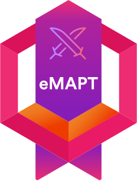
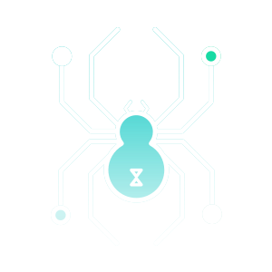

<h1 align="center">Ahmed Nayel</h1>
<h3 align="center">Offensive Security Researcher · Bug Bounty Hunter · CVE Contributor</h3>

  

  
  
  
  
  
  
  
  

---

## About

Offensive security practitioner based in **Egypt**, with hands-on experience across **web · mobile · network** domains. Reported valid vulnerabilities to organizations including **Visa · Indeed · Atlassian · Adobe**, with multiple coordinated disclosures and published CVEs. Ranked among the **top researchers in Egypt** on HackerOne. Active in CTFs, open-source security tooling, and public vulnerability research.

BSc Computers & Data Science — Faculty of Computer & Data Science, Alexandria University.

---

## GitHub

  
  

  

  

  

---

## CVE Discoveries

&nbsp; **[CVE-2026-5562](https://0xnayel.com/publications/CVE-2026-5562)** — Unauthenticated Remote Code Execution in **kafka-ui**

&nbsp; **[CVE-2026-4045](https://0xnayel.com/publications/CVE-2026-4045)** — LDAP Injection User Enumeration in **ProjectSend**

&nbsp; **[CVE-2026-4044](https://0xnayel.com/publications/CVE-2026-4044)** — Path Traversal via Arbitrary File Deletion in **ProjectSend**

&nbsp; **[CVE-2026-23852](https://0xnayel.com/publications/CVE-2026-23852)** — Stored XSS to RCE via Dynamic Icons in **SiYuan**

&nbsp; **[CVE-2025-1553](https://0xnayel.com/publications/CVE-2025-1553)** — Stored XSS in **Scale Project Management**

---

## Certifications

<table align="center">
  <tr>
    <td align="center" width="200">
      
    </td>
    <td align="center" width="200">
      
    </td>
    <td align="center" width="200">
      
    </td>
    <td align="center" width="200">
      
    </td>
  </tr>
  <tr>
    <td align="center">
      
    </td>
    <td align="center">
      
    </td>
    <td align="center">
      
    </td>
    <td align="center">
      
    </td>
  </tr>
</table>

---

## Stack

---

## Featured Writeups

<!-- BLOG-LIST:START -->
- [CAT CTF 25 — All Web Challenges Writeups](https://0xnayel.com/publications/cat-ctf-25-web-writeups)
- [HTB University CTF 2025 — All Web Challenges Walkthrough](https://0xnayel.com/publications/htb-university-ctf-2025-web)
- [Breaking Boundaries: From Limited Stored XSS to Open Redirect & CSRF Referrer Bypass](https://0xnayel.com/publications/stored-xss-open-redirect-csrf)
- [Secure Code Review Assessment for Javascript Full Stack (NextJS)](https://0xnayel.com/publications/secure-code-review-nextjs)
- [Critical $$$$ Bounty from PII Disclosure — Broken Access Control](https://0xnayel.com/publications/pii-disclosure-broken-access)
<!-- BLOG-LIST:END -->

Full archive at **[0xnayel.com](https://0xnayel.com)**.

---

## Featured Project

  

**MonMon** — AI-powered monitoring tool for bug bounty hunters. Tracks changes across subdomains, HTTP endpoints, command output, and scope pages. Alerts via Telegram, Discord, and webhooks.

---

## Get In Touch

  For engagements, collaboration, or responsible disclosure — reach out via the contact form at
  <a href="https://0xnayel.com/whoami#contact"><b>0xnayel.com</b></a>.

